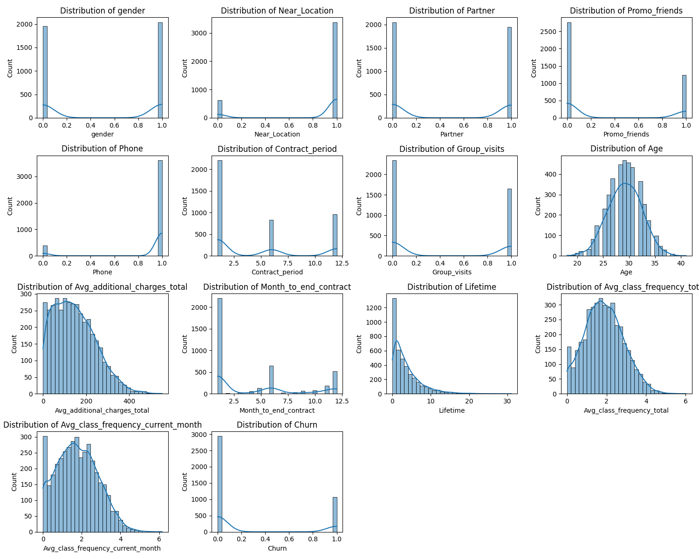
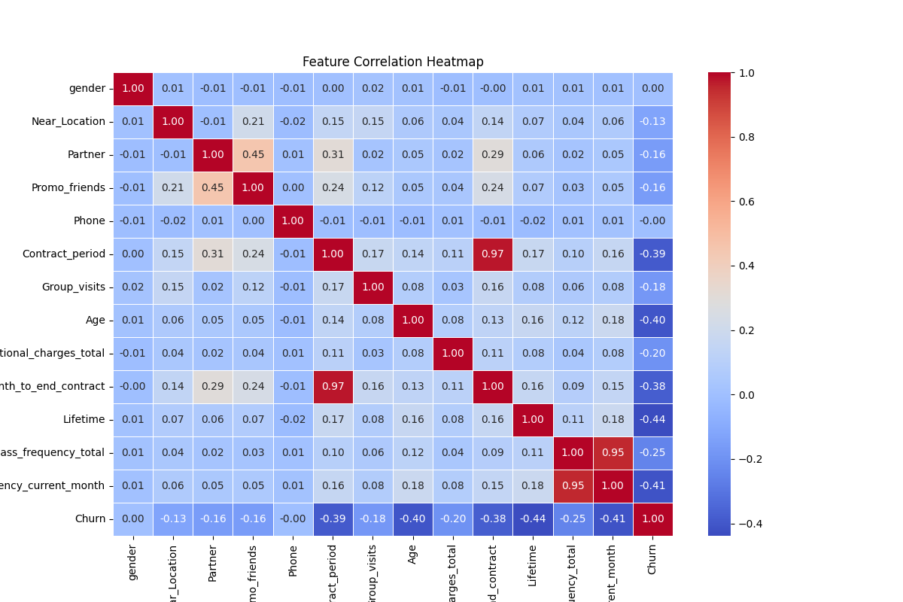
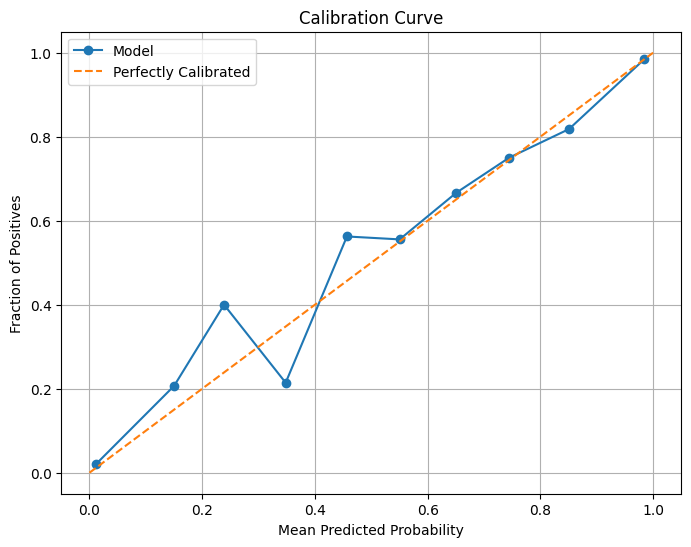
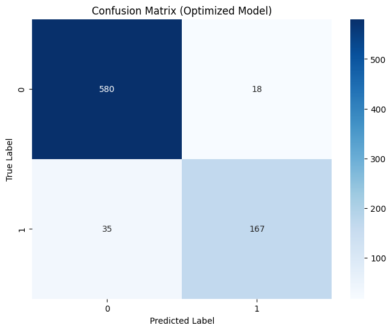
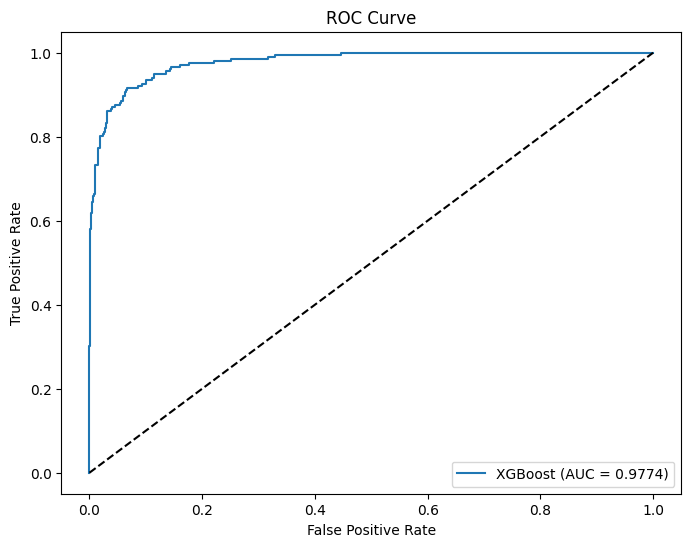

# 💪 SK Networks AI CAMP 9기 - 2nd Team: 근육빵빵  
- **개발 기간:** 2025.02.03 ~ 2025.02.04

---

# 📌 목차

1. [팀 소개](#1️⃣-팀-소개)
2. [프로젝트 개요](#2️⃣-프로젝트-개요)
3. [기술 스택](#3️⃣-기술-스택)
4. [WBS](#4️⃣-wbs)
5. [데이터 전처리 결과서](#5️⃣-데이터-전처리-결과서-eda)
6. [머신러닝 분석 및 결과](#6️⃣-머신러닝-분석-및-결과)
7. [기대효과 및 전략](#7️⃣-기대효과-및-전략)

<br>

----

# 1️⃣ **팀 소개**
### 팀명, '근육빵빵'이란?
- "근육 빵빵, 회원 이탈률 00명"
- **'헬스장 회원 이탈률 00명으로 만들고, 유지중인 회원들에게 근육을 빵빵하게 만들겠다'** 는 중의적인 의미를 담고 있습니다.


<br>

### 팀원 소개

<br>

| [@유지은](https://github.com/yujitaeng)                      | [@이광운](https://github.com/Leegwangwoon)                       | [@이윤재](https://github.com/Leeyoonjae)                       | [@최재동](https://github.com/Monkakaka)                       |
|---------------------------------------------------------------|---------------------------------------------------------------------|---------------------------------------------------------------------|---------------------------------------------------------------------|
|          |             |              |             |


<br>

----
# 2️⃣ **프로젝트 개요**

## 1. 프로젝트 개요
이 프로젝트는 **헬스장 고객 탈퇴 예측 시스템**을 구축하여, 고객 이탈을 사전에 감지하고 효과적으로 예방하는 방법을 탐색하는 것을 목표로 합니다.
- 머신러닝 모델을 활용해 고객 데이터를 분석
- 탈퇴 가능성을 예측하여 전략적인 고객 유지 방안 지원

<br>

## 2. 필요성 및 배경
최근 기업들은 급변하는 시장 환경과 치열한 경쟁 속에서 고객 유지(Customer Retention) 를 핵심 과제로 삼고 있습니다. <br>
특히, 구독 서비스, 피트니스 센터, 온라인 쇼핑몰, 금융 서비스 등 장기적인 고객 관계가 중요한 산업에서 고객 이탈(Churn)은 매출과 직결되는 중요한 문제입니다. <Br>

### **헬스장 산업의 위기**
- 회원 수 급감으로 인한 운영 타격 사례 증가
- 회원 이탈 → 수익 감소 & 브랜드 신뢰도 하락
- 지속적인 신규 고객 유치에는 한계 존재
- 기존 고객을 유지하는 것이 점점 더 중요
→ 탈퇴 예측 시스템을 통한 **효과적인 고객 유지 전략 필요**


출처 ㅣ https://view.asiae.co.kr/article/2025013115300100923

<br>

## 3. 구현 기능
헬스장 고객 탈퇴 예측 시스템은 다음과 같은 핵심 기능을 포함합니다.
- **데이터 수집 및 정제:** 고객 데이터를 수집하고 분석에 적합하도록 정제
- **머신러닝 모델 구축:** 고객 탈퇴 가능성을 예측하는 모델 개발
- **특성 분석:** 각 특성이 고객 탈퇴에 미치는 영향 평가
- **모델 최적화:** 데이터 전처리, 특성 선택, 모델 훈련 및 평가를 거쳐 최적 성능 도출
<br>

## 4. 목표
이 프로젝트의 주요 목표는 **고객 이탈을 사전에 감지하고 예방 전략을 마련하는 것**입니다.
- **고객 탈퇴 예측:** 머신러닝을 활용해 고객의 탈퇴 가능성을 조기에 감지
- **주요 탈퇴 원인 분석:** 객 이탈과 높은 연관성을 가진 핵심 요인 도출
- **맞춤형 탈퇴 방지 전략 수립:** 분석 결과를 기반으로 고객 유지율을 극대화할 대응 방안 마련
- **기업 경쟁력 강화:** 고객 이탈 최소화 → 수익 손실 감소, 브랜드 신뢰도 유지, 지속 성장 도모
<br>

## 5. **사용 데이터셋**
https://www.kaggle.com/datasets/adrianvinueza/gym-customers-features-and-churn

<br>

----

# 3️⃣ **기술 스택**
<br>

### 🛠 협업 및 문서화  
 
  
<br>

### 💻 도구  

<br>

### 😺 형상 관리
 
  
<br>

### 🚀 프로그래밍 언어  
  
<br>

### 📊 데이터 분석  
 
  
<br>

### 🤖 머신러닝  
  
<br>

### 📈 데이터 시각화  
 
  
<br>

### 🔗 대시보드  
  

<br>

----

# 4️⃣ **WBS**


<br>

----

# 5️⃣ **데이터 전처리 결과서 (EDA)**

### **Feature 설명**
1. ```gender```: 성별 (0 = 여성, 1 = 남성)
2. ```Near_Location```: 헬스장이 집 또는 직장과 가까운지 여부 (1 = 가까움, 0 = 멀다)
3. ```Partner```: 헬스장과 제휴된 기업 직원 여부 (1 = 제휴 기업 직원, 0 = 비제휴)
4. ```Promo_friends```: 친구 추천 프로모션을 통해 가입했는지 여부 (1 = 예, 0 = 아니오)
5. ```Phone```: 전화번호 제공 여부 (1 = 제공함, 0 = 제공 안 함)
6. ```Contract_period```: 계약한 헬스장 이용 기간 (개월 단위, 1/6/12 등)
7. ```Group_visits```: 단체 수업 참여 여부 (1 = 참여, 0 = 참여 안 함)
8. ```Age```: 가입자의 나이
9. ```Avg_additional_charges_total```: 총 추가 지출 비용 (추가 서비스나 상품 구매 금액)
10. ```Month_to_end_contract```: 현재 계약이 종료되기까지 남은 개월 수
11. ```Lifetime```: 헬스장 이용 개월 수 (가입 후 총 몇 개월 동안 이용했는지)
12. ```Avg_class_frequency_total```: 전체 평균 수업 참여 빈도 (주 단위)
13. ```Avg_class_frequency_current_month```: 최근 한 달간 평균 수업 참여 빈도 (주 단위)
14. ```Churn```: 이탈 여부 (1 = 헬스장을 그만둔 회원, 0 = 유지한 회원)

<br>

### 데이터 확인


<br>

### 결측치 확인


<br>

### 시각화



<br>

## **분석 결과**
고객의 **이탈률과 추가 지출**은 여러 요인에 영향을 받으며, 특히 **계약 기간, 연령대, 운동 빈도, 추가 지출 패턴, 그리고 계약 종료까지 남은 기간**이 주요한 영향을 미칩니다.

#### **1. 추가 지출 및 고객 행동 분석**  
- 대부분의 고객은 **낮은 금액의 추가 지출**에 집중하며, **높은 추가 지출 고객은 드뭄**  
- 그러나 **추가 지출이 높은 고객일수록 장기 유지 가능성이 큼**  
- **친구 추천(Promo_friends) 고객이 가장 높은 추가 지출**을 보이며,  
  **가까운 위치(Near_Location), 제휴사(Partner) 여부도 추가 지출에 영향**을 미침  
- **추천 프로그램 강화 & 특정 고객층 맞춤형 혜택 제공** → 추가 지출 증가 기대  

#### **2. 계약 기간과 이탈률**  
- **단기 계약(특히 1개월) 고객의 이탈률이 높음** → 장기 계약이 고객 유지에 효과적  
- **단기 계약 고객 대상 장기 계약 유도 프로모션 필요**    

#### **3. 연령대와 이탈률**  
- **젊은 고객층(18-25세)의 이탈률이 가장 높음**, 연령 증가할수록 이탈률 감소  
- **젊은 고객은 대안(다른 헬스장, 운동 방식 등)에 민감하게 반응**하는 경향  
- **젊은 층 대상 특별 혜택 & 지속적 관심 유도 프로그램 운영 필요**  

#### **4. 운동 빈도와 이탈률**  
- **운동 빈도가 낮을수록 이탈 가능성 증가** → 활동성이 낮은 고객의 충성도 낮음  
- **출석 이벤트, 클래스 추천, 맞춤형 피드백 제공 등 참여 유도 전략 필요**  

#### **5. 계약 종료 임박 고객의 이탈 방지**  
- **계약 종료가 가까울수록 이탈 가능성 증가** → 사전 식별 및 재계약 유도 필요  
- **만료 전 특별 혜택, 추가 할인, 맞춤형 혜택 제공을 통한 유지 전략 필수**

👉 **데이터 기반 분석을 통해 고객 유지율을 높이고, 수익 극대화를 위한 전략을 마련할 수 있습니다.**  
<br><br>

<br>

---

# 6️⃣ 머신러닝 분석 및 결과
<br>

| 모델명         | Accuracy(정확도) | Precision(정밀도) | f1-score | ROC   |
| -------------- | ---------------- | ----------------- | -------- | ----- |
| Knn            | 0.85             | 0.88              | 0.90     | 0.89  |
| 결정트리       | 0.8812           | 0.8092            | 0.7467   | 0.9064|
| 로지스틱 회귀  | 0.915            | 0.8681            | 0.8259   | 0.9694|
| 랜덤 포레스트  | 0.9163           | 0.8358            | 0.8337   | 0.96  |
| 서포트 벡터 머신| 0.9225           | 0.8977            | 0.8360   | 0.9683|
| LightGBM       | 0.9287           | 0.94              | 0.95     | 0.97  |
| **🔥 XGBoost**        | **0.9333**           | **0.9027**            | **0.8512**   | **0.9774**|

<br>

아래의 이미지는, 다른 모델들 보다 뛰어난 성능을 보여주고 있는 **'XGBoost'** 의 결과 입니다.

<br>

### 1. XGBoost Calibration Curve

- 과정이 진행됨에 따라, 예측 확률이 실제 클래스 레이블과 잘 일치하게 되어 모델이 잘 보정됨.

<br>

### 2. XGBoost Confusion Matrix

- **진짜 음성 (TN)**: 580건 (이탈하지 않을 것으로 예측, 실제로 이탈하지 않음)
- **거짓 양성 (FP)**: 33건 (이탈할 것으로 예측, 실제로 이탈하지 않음)
- **거짓 음성 (FN)**: 34건 (이탈하지 않을 것으로 예측, 실제로 이탈함)
- **진짜 양성 (TP)**: 168건 (이탈할 것으로 예측, 실제로 이탈함)

<br>

### 3. XGBoost ROC Curve

- ROC 곡선은 모델이 양성과 음성을 잘 구분하고 있음을 보여줌. (곡선이 왼쪽 위 코너에 가까울수록 성능이 우수)
- AUC 값이 0.9774로 매우 높아, 모델이 98%의 확률로 양성과 음성을 구분할 수 있음을 의미함.
  - 이는 모델의 분류 성능이 뛰어나며 신뢰할 수 있는 예측을 제공함을 나타냄.

<br>

### 4. 시연 페이지


<br>

#### **최종 결론**
- 모델의 예측 성능이 전반적으로 우수하며, **91.63%의 높은 정확도**를 기록.
- 고객 이탈 예측에 있어 **고객의 생애 기간**과 **수업 참여도**가 가장 중요한 지표임.
- 하이퍼파라미터 튜닝 결과, 복잡한 모델이 아니어도 충분한 성능을 발휘할 수 있음.
- ROC 곡선과 AUC 분석 결과, 모델의 분류 성능이 매우 뛰어나며 신뢰할 수 있는 예측을 제공함.
- 실제 활용을 위해 고객의 생애 기간과 수업 참여도를 중점적으로 모니터링하고, 이탈 위험이 있는 고객들에 대한 선제적 관리가 필요함.


<br>

-----


# 7️⃣ **기대효과 및 전략**
고객 탈퇴는 기업 수익에 직접적인 영향을 미칩니다. 고객 이탈을 사전에 예측하고 예방하는 시스템을 통해 기업은 경쟁력을 높이고 장기적인 성장을 도모할 수 있습니다.
<br>
머신러닝 기법을 활용하여 정확한 예측과 고객 맞춤형 서비스를 제공함으로써 탈퇴를 방지하고 고객 만족도를 향상시킬 수 있습니다.

### **전략 방향**  
1. **추가 지출 증대 전략**  
   - 친구 추천 프로그램(Promo_friends) 강화를 통해 추가 지출을 유도.  
   - 제휴사 회원(Partner)과 근처 거주 고객(Near_Location)에게 맞춤형 혜택 제공.  

2. **이탈률 감소 및 고객 유지 전략**  
   - **단기 계약 고객에게 장기 계약 전환 프로모션 제공** (예: 3개월 이상 가입 시 할인).  
   - **젊은 고객층(18-25세) 대상 특별 혜택 및 지속적인 관심 유도** (예: 맞춤형 프로그램, 멤버십 보상 등).  
   - **운동 빈도가 낮은 고객을 대상으로 참여율을 높일 수 있는 이벤트 및 맞춤형 리마인드 서비스 제공**.  
   - **계약 종료 임박 고객을 사전 식별하고, 재계약 유도를 위한 프로모션 진행**.  

<br>

-----

# 8️⃣ **한 줄 회고**

#### 🐶 **유지은**
- 사용한 모델이 실제 클래스 확률을 정확하게 예측하는지 평가하기 위해 Calibration Curve 지표를 학습했다. 또한, 머신러닝을 활용하여 고객 이탈을 예측하고, 이를 기반으로 전략적 방향을 설정하여 브랜드가 효과적인 대응 방안을 마련할 수 있도록 제안하는 경험을 쌓았다.

#### 🐷 **이광운**
- 모델 선정의 중요성을 각 모델의 결과 지표를 보며 느꼈고 어떻게 응용하느냐에 따라 (회원 데이터 -> 회원 이탈 예측처럼)서비스로 유저에게 제공될 수 있음을 배우는 시간이였음

#### 🐮 **이윤재**
- 이번 프로젝트를 통해 입력 데이터의 형태에 따라 정규화를 다르게 적용하는 것이 모델의 예측 성능과 평가에 
영향을 미친다는 점을 깨달았다.
처음에는 모든 수치형 데이터를 동일한 방식으로 정규화했지만, 특정 변수(예: 범위가 극단적으로 다른 변수)에서는 MinMaxScaler 대신 StandardScaler를 적용하거나, 일부 변수는 정규화하지 않는 것이 더 좋은 성능을 낼 수도 있다는 점을 확인했다.
이러한 차이를 분석하고 최적의 전처리 방법을 찾는 것이 머신러닝 모델 성능 개선의 중요한 과정임을 다시 한번 실감했다.

#### 🐮 **최재동**
- 모델을 저장하고 streamlit에서 불러와서 로드하는 과정에서 jupyter notebook에서 구현했던 결과와 streamlit에서 구현한 결과가 달라 고민한 적이 있었는데, 중간의 스케일러를 누락해서 벌어졌던 일이었다. 스케일러 유무가 결과에 크게 영향을 미칠수 있다는것을 체감하게 되었으며 모델 선정 못지않게 신경써야할 점이 많다는 것을 느꼈다.

<br>

----

<br> <br>

<p align="center"> <strong>"근육빵빵과 함께 회원을 유치하고, 근육빵빵 오운완하세요💪"</strong> </p>

<br>

<p align="center">
  
</p>

- 이미지 원저작자: [이주용 작가 (작가 페이지)](https://www.instagram.com/b2ang_official?igsh=OXlwNmQzeXF0bjVh)


